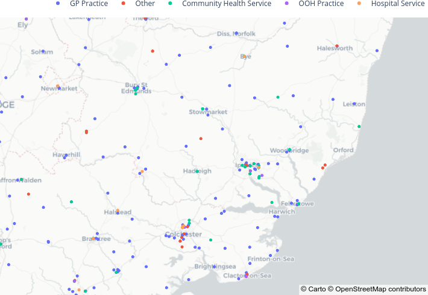
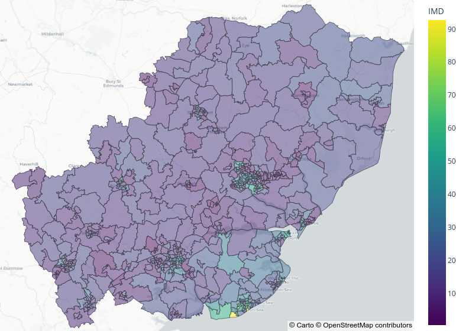

# ESNEFT Analysis - Diabetes Inequalities

[](https://github.com/GIScience/badges#experimental)

## Table of contents

  * [Installation](#installation)
  * [Setup](#setup)
  * [Retrieve Data](#retrieve-public-data)
    * [Download](#download)
    * [Process](#process)
      * [Aggregate By Practice Level](#aggregate-by-practice-level)
      * [Aggregate By LSOA Level](#aggregate-by-lsoa-Level)
  * [Visualise](#visualise)
    * [Practice Map](#practice-map)
    * [LSOA Map](#lsoa-map)
  * [Further Documentation](#additional-documentation)
  * [Contributing](#contributing)
  * [License](#license)
  * [Contact](#contact)


## Installation
Installation is possible via `pip` as shown below.

Unix/macOS
```bash
python3 -m pip install esneft_tools
```

Windows
```bash
py -m pip install esneft_tools
```

#### Install within a Virtual Environment (optional)
<details>
<summary><strong>Unix/macOS</strong></summary>

```bash
python -m venv esneft_tools
source esneft_tools/bin/activate
python3 -m pip install esneft_tools
```
</details>

<details>
<summary><strong>Windows</strong></summary>

```bash
py -m venv esneft_tools
esneft_tools/Scripts/Activate.ps1
py -m pip install esneft_tools
```

If running scripts is disabled on your system then run the following command before activating your environment.

```bash
Set-ExecutionPolicy -ExecutionPolicy RemoteSigned -Scope CurrentUser
```
</details>


#### Geospatial Dependencies (optional)
Additional geospatial utilities may be optionally installed as below.
Note these packages have non-trivial dependencies and automatic installation may not work on all systems.

An additional optional dependency, OSMnx, must be installed by the user.
Please refer to the [OSMnx documentation](https://osmnx.readthedocs.io/en/stable/) for further installation instructions.

<details>
<summary><strong>Clear here for code</strong></summary>

Unix/macOS
```bash
python3 -m pip install esneft_tools[geo]
```

Windows
```bash
py -m pip install esneft_tools[geo]
```

</details>


## Setup
The logging level of `esneft_tools` can be set via the `setVerbosity()` function.

```python
import logging
from esneft_tools.utils import setVerbosity
from esneft_tools import download, process, visualise

setVerbosity(logging.INFO)
```

## Retrieve Public Data

### Download

#### From Host
Each of the `esneft_tools.download.getData().fromHost()` functions retrieve a static copy of a particular data set from GitHub.
A local copy of these tables is saved to `./.data-cache/` by default.
Each can be obtained individually but it is recommended to retrieve all data, as below.

```python
# Instantiate data download class.
getData = download.getData(cache='./.data-cache')

# Retrieve all data as dictionary (recommended)
data = getData.fromHost('all')
```

* `all` **(default)**
  * Retrieve all of the below data in dictionary format (**recommended**).
*  `postcodeLSOA`
  * Postcode -> LSOA (2011) lookup Table from [ArcGIS](https://hub.arcgis.com/datasets/ons::national-statistics-postcode-lookup-2021-census-november-2022/about)
*  `imdLSOA`
  * Indices of Deprivation by LSOA in England from [National Statistics (.gov.uk)](https://assets.publishing.service.gov.uk/government/uploads/system/uploads/attachment_data/file/845345/File_7_-_All_IoD2019_Scores__Ranks__Deciles_and_Population_Denominators_3.csv/preview)
*  `populationLSOA`
  * LSOA population estimates, by age and sex, from [ONS](https://www.ons.gov.uk/peoplepopulationandcommunity/populationandmigration/populationestimates/datasets/lowersuperoutputareamidyearpopulationestimates)
* `ethnicityLSOA`
  * Proportion of ethnicity minorities (non-white) by LSOA from [NOMIS](https://www.nomisweb.co.uk/query/select/getdatasetbytheme.asp?opt=3&theme=&subgrp=)
*  `areaLSOA`
  * Land hectare measures by LSOA from [ArcGIS](https://hub.arcgis.com/datasets/ons::standard-area-measurements-latest-for-2021-statistical-geographies-in-england-and-wales-v2-1/about)
* `gpRegistration`
  * GP registration by LSOA [NHS Digital](https://digital.nhs.uk/data-and-information/publications/statistical/patients-registered-at-a-gp-practice/metadata)
* `gpPractice`
  * GP Practice information from [NHS Digital](https://digital.nhs.uk/services/organisation-data-service/file-downloads/gp-and-gp-practice-related-data)
* `gpStaff`
  * GPs by GP Practices from [NHS Digital](https://digital.nhs.uk/services/organisation-data-service/file-downloads/gp-and-gp-practice-related-data)
* `qof`
  * Quality and Outcomes Framework, 2021-22 from [NHS Digital](https://digital.nhs.uk/data-and-information/publications/statistical/quality-and-outcomes-framework-achievement-prevalence-and-exceptions-data/2021-22)
* `geoLSOA`
  * LSOA GeoJSON from [UK Data Service](https://statistics.ukdataservice.ac.uk/dataset/2011-census-geography-boundaries-lower-layer-super-output-areas-and-data-zones)
* `esneftLSOA`
  * List of LSOAs within ESNEFT trust.
* `esneftOSM`
  * OpenStreetMap (OSM) data for ESNEFT area from [Geofabrik](https://download.geofabrik.de/europe/great-britain/england.html)

#### From Source
Alternatively, the `.fromSource()` method can be used to retrieve each dataset directly from its public source.
By default, `esneft_tools` will retrieve the source data that matches the `fromHost()` methods.
Each source URL can be updated to newer versions by providing a YAML file to `download.getData()` as shown below.
An example of the YAML file is shown [here](./README_files/sourceURL.yaml).

<details>
<summary><strong>Clear here for code</strong></summary>

```python
# Instantiate data download class.
getData = download.getData(sourceURL='sourceURL.yaml', cache='./.data-cache')

# Retrieve a specific dataset from host.
# Note: "all" does not work with .fromSource().
imdLSOA = getData.fromSource('imdLSOA')
```

</details>

### Processing

#### Aggregate by Practice Level
The `getGPsummary` function aggregates the downloaded data to practice level statistics.

```python
GPsummary = process.getGPsummary(**data, iod_cols='IMD')
```

| Field               | Description                                               |
| ---                 | ---                                                       |
| *OrganisationCode*  | Practice Service Code                                     |
| IMD                 | Mean Index of Multiple Deprivation of Registered Patients |
| Patient             | Total Registered Patients                                 |
| QOF-DM              | QOF achievement for Diabetes mellitus (max 76)            |
| DM-prevalance       | Prevalence of Diabetes mellitus                           |
| PCDS                | Postcode                                                  |
| OpenDate            | Opening Date                                              |
| CloseDate           | Closing Date                                              |
| Status              | Service Status (e.g. Active)                              |
| PrescribingSetting  | Service Type (e.g. GP Practice)                           |
| currentStaff        | Current Practitioners                                     |
| departedStaff       | Total Departed Practitioners                              |
| meanStaff           | Average Working Practitioners                             |
| annualStaffTurnover | Mean Annual % Practitioner Turnover                       |
| Lat                 | Latitude of Site                                          |
| Long                | Longitude of Site                                         |
| patientPerGP        | Total Registered Patient per Average Practitioner Count   |
| ESNEFT              | Boolean Flag of Practices within ESNEFT                   |
| Node                | Closest OSM Map Node to Site                              |


#### Aggregate by LSOA Level
The `getLSOAsummary` function aggregates the downloaded data LSOA level statistics.

```python
LSOAsummary = process.getLSOAsummary(**data, iod_cols='IMD')
```

| Field         | Description                               |
| ---           | ---                                       |
| *LSOA11CD*    | LSOA (2011) Code                          |
| LSOA11NM      | LSOA (2011) Name                          |
| Age (median)  | Median Age of Population                  |
| Population    | Population Estimate (2011 Census)         |
| LandHectare   | Land Area (Hectares)                      |
| Patient       | Total Registered GP Patients              |
| IMD           | Index of Multiple Deprivation             |
| IMD (q5)      | Index of Multiple Deprivation (quintiles) |
| DM-prevalance | Prevalence of Diabetes mellitus           |
| Density       | Population Density                        |
| ESNEFT        | Boolean Flag of LSOAs within ESNEFT       |


### Visualise

### Practice Map

```python
fig = visualise.scatterGP(GPsummary[GPsummary['Status'] == 'Active'], minCount=250)
```


 <br> *Map of Practice Distributions within ESNEFT (Plotly Interactive)*


### LSOA Map

```python
fig = visualise.choroplethLSOA(LSOAsummary, data['geoLSOA'], colour='IMD')
```


 <br> *Choropleth Map of LSOA Domains within ESNEFT coloured by IMD (Plotly Interactive)*


## Further Documentation
Refer to the [additional documentation](./README_files/docs.md) for further examples of functionality.


## Contributing

Contributions are what make the open source community such an amazing place to learn, inspire, and create. Any contributions you make are **greatly appreciated**.

1. Fork the Project
2. Create your Feature Branch (`git checkout -b feature/AmazingFeature`)
3. Commit your Changes (`git commit -m 'Add some AmazingFeature'`)
4. Push to the Branch (`git push origin feature/AmazingFeature`)
5. Open a Pull Request

See [CONTRIBUTING.md](./CONTRIBUTING.md) for detailed guidance.


## License
Distributed under the MIT License. _See [LICENSE](./LICENSE) for more information._


## Contact
If you have any other questions please contact the author, [Stephen Richer](mailto:stephen.richer@proton.me?subject=[GitHub]%20esneft_tools).
